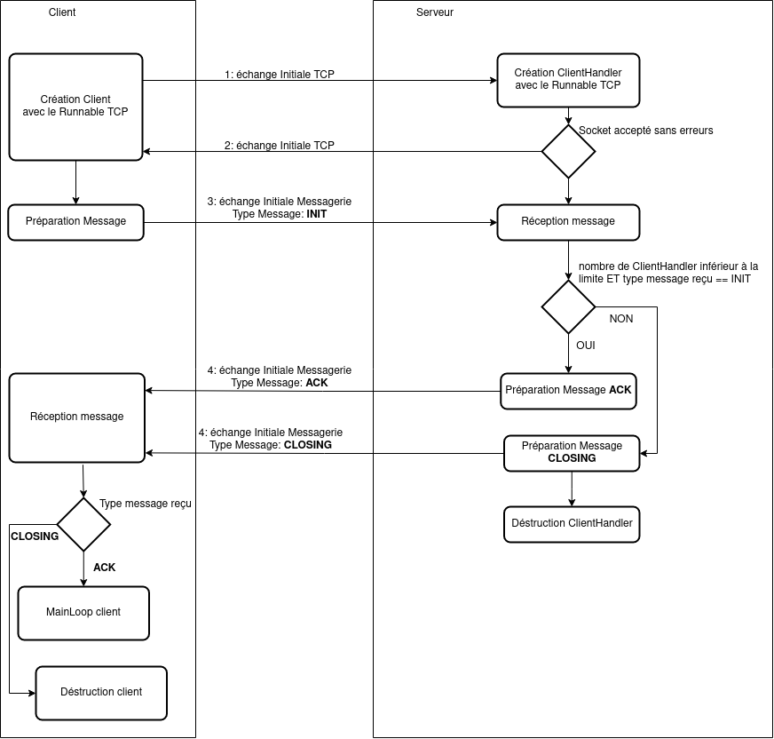

# SAE32

## Introduction
application android en Java, dans le cadre de ma SAE32 (BUT RT Roanne). Le but de cette SAE était de découvrir le langage Java et de réaliser une application réseau Android avec Android Studio. Pour cette SAE j'ai réaliser:
- Un client TCP/UDP
- un serveur TCP/UDP
- un système de messagerie avec l'envoie soit d'un objet sérialisé, soit d'un json.

## structure du programme

