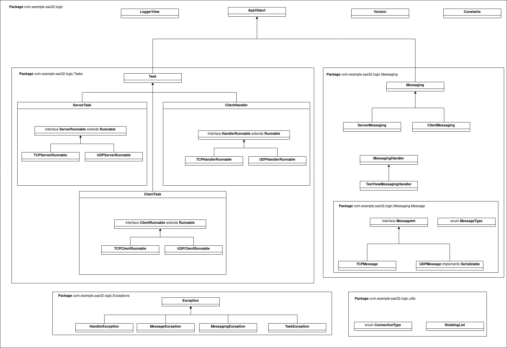

# SAE32

## Introduction
application android en Java, dans le cadre de ma SAE32 (BUT RT Roanne). Le but de cette SAE était de découvrir le langage Java et de réaliser une application réseau Android avec Android Studio. Pour cette SAE j'ai réaliser:
- Un client TCP/UDP
- un serveur TCP/UDP
- un système de messagerie avec l'envoie soit d'un objet sérialisé, soit d'un json.

## structure du programme
Le programme se sépare en 2 parties:
- la partie logique (__Package__ com.example.sae32.logic) permettant la gestion des threads, la gestion client/serveur, messagerie,...
- la partie application (__Package__ com.example.sae32) permettant la gestion de l'affichage, gérer les bouttons,...



Dans la suite de ce rapport je ne m'attarderais seulement sur la partie logique du programme

### Tasks
Ce package, comporte toutes les tâches que l'application peut lancé. Il était possible d'utiliser la classe AsyncTask d'android studio, mais étant donné qu'elle est, depuis récemment, obsolète j'ai décider de creer mon propre système de thread en utilisant la bibliothèque java.util.concurrent. Donc j'ai créer ma propre classe __Task__. Cette classe est déclaré comme "abstract" (abstraite) car elle est censé être utilisé par des sous classes qui réaliserons différentes tâches. Les méthodes les plus importantes sont:
```Java
abstract protected void doInBackground();
abstract protected void onShutdown();
public synchronized void doOnMainThreadAndWait(Runnable r);
public void run();
public void kill();
```
- run: cette méthode est à appelé pour lancé la tâche.
- kill: méthode à appelé pour stopper la tâche.
- doInBackground: cette méthode doit être redéfinit dans les sous classes. c'est cette méthode qui sera executé dans un autre thread lors de l'appel de la méthode "run".
- onShutdown: cette méthode doit être redéfinit dans les sous classes. c'est cette méthodde qui sera appelé lors de l'appel de la méthode "kill".
- doOnMainThreadAndWait: cette méthode est appelé pour éxecuté un Runnable (un objet avec la méthode "run") sur le Thread principale. Utilisé principalement pour faire des actions sur le Thread de l'interface graphique.

Pour ce projet, j'ai créer 3 tâches:
- ClientTask: tâche client. Permet de gérer un client voulant se connecter à un serveur.
- ServerTask: tâche Serveur: permet de gérer un serveur.
- ClientHandle: permet de gérer un client se connectant au serveur. à chaque connexion d'un nouveau client sur un serveur, un ClientHandler est créer.

### Messagerie
Pour la communication, j'ai creer 2 classes, 1 interface et 1 énumération:
- MessageInt: Interface pour tous types de messages. Les classes implémentant cette interface doivent implémenter ces méthodes:
```Java
String getPublishableString() throws MessageException;
MessageType getType();
void setMsg(String msg);
```
- TCPMessage: objet message TCP. La méthode "toString" est utilisé pour récupérer un json en format Sting, afin de l'envoyer à un socket TCP.
- UDPMessage: objet message UDP. La méthode "getBuffer" permet de récuperer le l'objet en octet afin de l'envoyer sur un socket UDP

Initialisation d'une messagerie TCP:


Initialisation d'une messagerie UDP:


